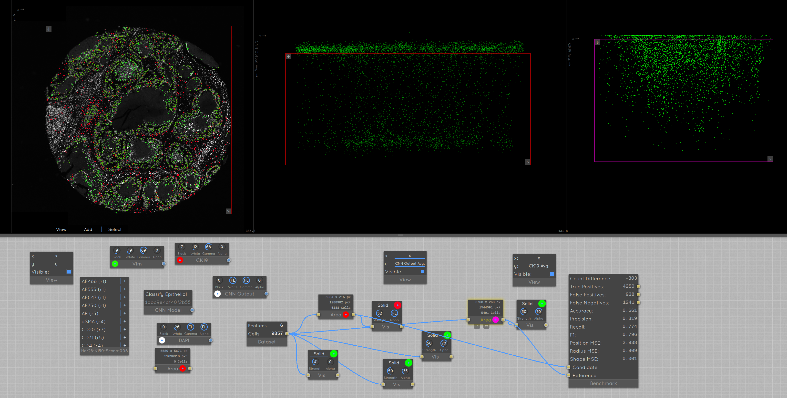

# Interactive Deep Learning Tool for Cell Segmentation and Analysis
An tool to enable biologists to train machine learning models for their own pathology images.

Open the **example projects** in the client to learn how to use the software.

## Client

### Requirements

* Win / macOS / Linux (cross-compilation for Android and iOS should work, too)
* Qt 5.14
* QtCreator or qmake

You also need to create an SSL certificate (core/data/luminosus_websocket.cert and core/data/luminosus_websocket.key). Please use the standard commands you can find on the Internet to create those.

### Build Instructions

* `git submodule update --init --recursive`
* open `src/luminosus-microscopy.pro` in Qt Creator, configure and hit the green play button

## Server

### Requirements

* Python 3 and dependencies as listed in `requirements.txt` (most notably fast.ai and Flask)
* Nvidia GPU recommended for accelerated training and inference

### Set-up

* copy SSL certificate from client in case you want to use HTTPS
* (optionally) create and activate Conda environment
* install Python dependencies
* run `export FLASK_APP=main.py`
* start the server with `python3 -m flask run --host='::' --port=55712` to listen for IPv6 HTTP requests
* alternatively run `python3 -m flask run --host='::' --port=55712 --cert=luminosus_websocket.cert --key=luminosus_websocket.key` for HTTPS
* enter the IP address of the server in the clients settings, it will connect to it automatically

